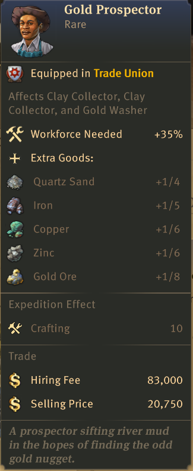
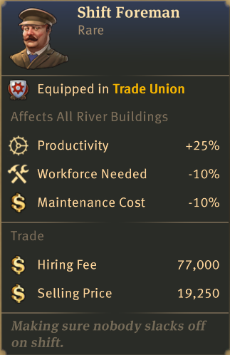

# Anno 1800: River Slot Specialists

This repository contains the Anno 1800 mod "[Gameplay] River Slot Specialists", which adds trade union items for the buildings of the "Riverslot Buildings OW/NW" mod by Taludas.

This mod requires the following mods to function:

- [River Slots OW/NW (Taludas)](https://mod.io/g/anno-1800/m/riverslot-buildings-ownw)
- [Riverslot Buildings OW/NW (Taludas)](https://mod.io/g/anno-1800/m/riverslot-buildings-ownw)

The repository for these mods can be found here on GitHub: [Taludas/RiverSlots](https://github.com/Taludas/RiverSlots/)

## Items (WIP)

The following items are added to the game:

| Icon | Name | Rarity | Affected buildings | Effects |
|-|-|-|-|-|
|  | Gold Prospector | Rare | Clay Collector OW Clay Collector NW Gold Washer NW | Workforce needed +35 % + 1/4 Quartz Sand +1/5 Iron +1/6 Copper +1/6 Zinc +1/8 Gold Ore |
|  | Shift Foreman | Rare | All riverslot buildings | Productivity +25 % Workforce needed -10 % Maintenance costs -10 % |

## Screenshots (WIP)

